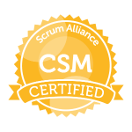
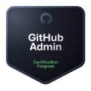
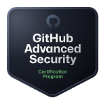
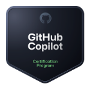
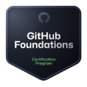

## Hi there, I'm a-shinba from Japan!! 👋
### Call me Aki or Shinba ☺️

🌟 **Areas of Expertise**  
　🔥 GitHub  
　🔥 Microsoft Azure  
　🔥 DevOps  
　🔥 Developer Productivity  

🎓 **Official GitHub Accreditations and Certifications +α**  
　- GitHub-accredited in Copilot and Admin  
　- Certified in GitHub Foundations, Actions, Admin, Advanced Security, and Copilot  
　- Scrum Master (Certified)

**Events**  
　🚀 Organizer of **Alternative Architecture Dojo**, `#AADOJO`  
　🚀 Organizer of **GitHub Dockyard**, `#GitHubDockyard`

🖊 **Editorial Work**  
　✍️ Lead editor for the tech blog: [AADOJO](https://aadojo.alterbooth.com/)

🌐 **Social Media**  
　🐦 X (Twitter): [a-shinba](https://x.com/shinbaz)  
　🔗 LinkedIn: [Check!](https://www.linkedin.com/in/akitaka-shinba-b627aa52/)

💬 **Feel free to ask me anything about using GitHub and GitHub Copilot!** 🚀💻✨

I also provide GitHub development experience programs and training for educational institutions and students. Feel free to reach out!  
教育機関、学生向けのGitHubを使った開発体験プログラムや、トレーニングについても提供しています。お気軽にお声がけください！

---  

  

